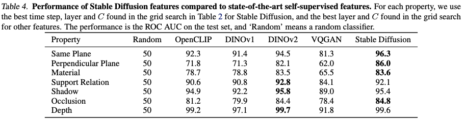

# What Does Stable Diffusion Know about the 3D Scene?

This is the official implementation of 2023 paper "What Does Stable Diffusion Know about the 3D Scene" by <a href="https://championchess.github.io/" target="_blank">Guanqi Zhan</a>, <a href="https://chuanxiaz.com" target="_blank">Chuanxia Zheng</a>, <a href="https://weidixie.github.io/" target="_blank">Weidi Xie</a>, and <a href="https://scholar.google.com/citations?user=UZ5wscMAAAAJ&hl=en" target="_blank">Andrew Zisserman</a>, including the datasets about different physical properties introduced in the paper.


- [paper link](https://arxiv.org/pdf/2310.06836.pdf)
- [project page](https://www.robots.ox.ac.uk/~vgg/research/phy-sd/)


## Installation (Python 3.8.8 + Numpy 1.20.1 + PyTorch 1.13.1)

```
pip install pycocotools
pip install Pillow
pip install scipy
pip install -U scikit-learn
pip install ipdb
pip install scikit-image
```


## Extract Stable Diffusion Feature
Clone the github https://github.com/Tsingularity/dift/tree/main, and put the files under `dift/` of this github. Use `dift/dift_sd.py` in this github to replace `src/models/dift_sd.py`. Then fill in the paths and

```
python dift/extract_dift_depth.py
```


## Download Original Datasets
For Same Plane and Perpendicular Plane: https://github.com/NVlabs/planercnn

For Material: https://github.com/apple/ml-dms-dataset

For Shadow: https://github.com/stevewongv/InstanceShadowDetection

For Occlusion: https://github.com/Championchess/A-Tri-Layer-Plugin-to-Improve-Occluded-Detection/tree/master and https://cocodataset.org/#home

For Support Relation and Depth: https://cs.nyu.edu/~silberman/datasets/nyu_depth_v2.html


## Download Our Datasets


Row 1 for **Occlusion** and Row 2 for **Depth** 

### Depth
<a href="https://www.robots.ox.ac.uk/~vgg/research/phy-sd/datasets/depth_img_name_list.zip" target="_blank">Train/Val/Test Image Names</a> | <a href="https://www.robots.ox.ac.uk/~vgg/research/phy-sd/datasets/depth_region_pair.zip" target="_blank">Regions and Pairs</a>


## Train and Test Linear SVM
### Depth
```
python SVM/depth_train_test_svm.py
```


## Experiment Results





## Citation
Please cite our paper if you use the code/model/dataset of this github.
```
@article{zhan23physd,
author       = "Guanqi Zhan and Chuanxia Zheng and Weidi Xie and Andrew Zisserman",
title        = "What Does Stable Diffusion Know about the 3D Scene?",
booktitle    = "arXiv",
year         = "2023",
}
```
